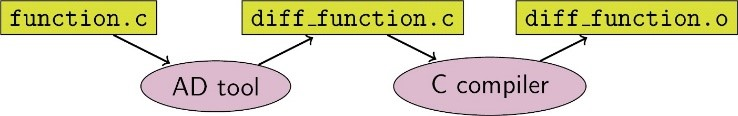

# 函数式微分编程

目前主流的深度学习框架有三种自动微分技术：
- 基于静态计算图的转换：在编译时将网络转换为静态数据流图，然后将链式规则转换为数据流图，实现自动微分。
- 基于动态计算图的转换：以算子重载的方式记录前向执行时网络的操作轨迹，然后将链式规则应用到动态生成的数据流图中，实现自动微分。
- 基于源码的转换：该技术是从函数式编程框架演化而来，对中间表达（程序在编译过程中的表达形式），以即时（Just-In-Time，JIT）编译的形式进行自动微分变换，支持复杂的流程控制场景、高阶函数和闭包。基于源码转化的自动微分如下图所示。

TensorFlow早期采用静态计算图，而PyTorch采用动态计算图。静态图可以利用静态编译技术优化网络性能，但是组建或调试网络非常复杂。使用动态图非常方便，但很难在性能上达到极限优化。

昇思MindSpore开发了一种新的策略，即基于源码转换的自动微分。一方面，它支持流程控制的自动微分，因此构建像PyTorch这样的模型非常方便。另一方面，昇思MindSpore可以对神经网络进行静态编译优化，从而获得良好的性能。

昇思MindSpore自动微分的实现可以理解为对程序本身进行符号微分，因为MindSpore IR是函数式的中间表达，它与基本代数中的复合函数有直观的对应关系，只要已知基础函数的求导公式，就能推导出由任意基础函数组成的复合函数的求导公式。MindSpore IR中每个原语操作可以对应为基础代数中的基础函数，这些基础函数可以构建更复杂的流程控制。

