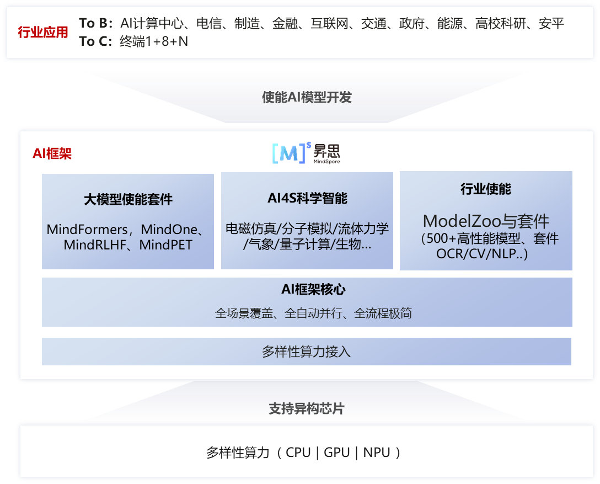
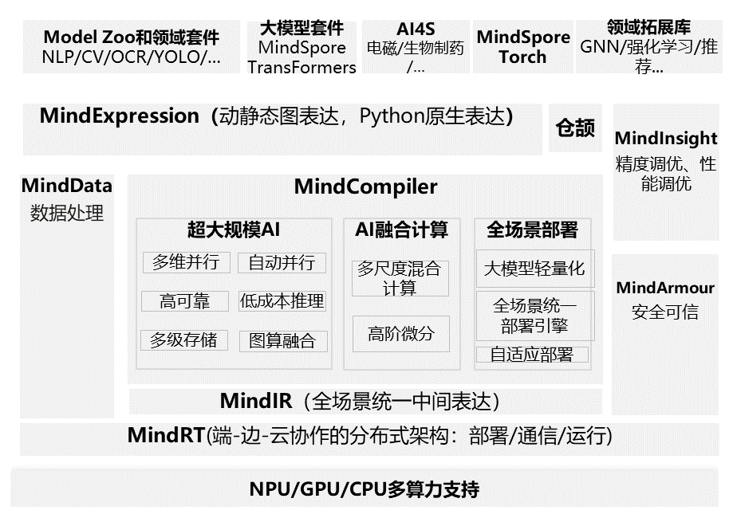

# 昇思MindSpore介绍

## 昇思MindSpore定位

昇思MindSpore是面向“端-边-云”全场景设计的AI框架，旨在弥合AI算法研究与生产部署之间的鸿沟。在算法研究阶段，为开发者提供动静统一的编程体验以提升算法的开发效率；生产阶段，自动并行可以极大加快分布式训练的开发和调试效率，同时充分挖掘异构硬件的算力；在部署阶段，基于“端-边-云”统一架构，应对企业级部署和安全可信方面的挑战。开源以来，秉持全场景协同、全流程极简、全架构统一三大价值主张，致力于增强开发易用性、提升原生支持大模型和AI+科学计算的体验。” 向上使能AI模型创新，对下兼容多样性算力（NPU、GPU、CPU）。

To B：面向AI计算中心、电信、制造、金融、互联网、交通、政府、能源、高校科研、安平，给国计民生行业提供一个更有的AI选择；

To C：使能终端1+8+N，智能手机，大屏、音箱、眼镜、手表、车机、耳机、平板、PC等消费级设备；

## 昇思MindSpore架构

昇思MindSpore整体架构分为四层（如图 1所示）：

- **模型层**，为开发者提供开箱即用的功能，该层主要包含预置的模型和开发套件，以及图神经网络（GNN）、深度概率编程等热点研究领域拓展库；
- **表达层（MindExpression）**，为开发者提供AI模型开发、训练、推理的接口，支持开发者用原生Python语法开发和调试神经网络，其特有的动静态图统一能力使开发者可以兼顾开发效率和执行性能，同时该层在生产和部署阶段提供全场景统一的C++接口；
- **编译优化（MindCompiler）**，作为AI框架的核心，以全场景统一中间表达（MindIR）为媒介，将前端表达编译成执行效率更高的底层语言，同时进行全局性能优化，包括自动微分、代数化简等硬件无关优化，以及图算融合、算子生成等硬件相关优化；
- **运行时**，按照上层编译优化的结果对接并调用底层硬件算子，同时通过“端 - 边 - 云”统一的运行时架构， 支持包括联邦学习在内的“端 - 边 - 云”AI 协同。

