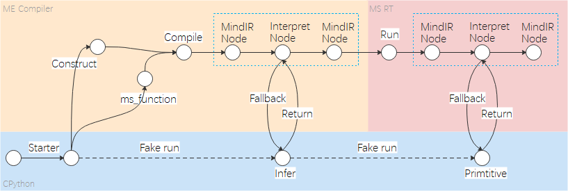

# 计算图

## 动静统一

传统AI框架主要有2种编程执行形态，静态图模式和动态图模式。静态图模式会基于开发者调用的框架接口，在编译执行时先生成神经网络的图结构，然后再执行图中涉及的计算操作。静态图模式能有效感知神经网络各层算子间的关系情况，基于编译技术进行有效的编译优化以提升性能。但传统静态图需要开发者感知构图接口，组建或调试网络比较复杂，且难于与常用Python库、自定义Python函数进行穿插使用。动态图模式，能有效解决静态图的编程较复杂问题，但由于程序按照代码的编写顺序执行，系统难于进行整图编译优化，导致相对性能优化空间较少，特别面向DSA等专有硬件的优化比较难于使能。

昇思MindSpore由于基于源码转换机制构建神经网络的图结构。因此相比传统的静态图模式，能有更易用的表达能力。同时也能更好的兼容动态图和静态图的编程接口，比如面向控制流，动态图可以直接基于Python的控制流关键字编程。而静态图需要基于特殊的控制流算子编程或者需要开发者编程指示控制流执行分支。这导致了动态图和静态图编程差异大。而昇思MindSpore的源码转换机制，可基于Python控制流关键字，直接使能静态图模式的执行，使得动静态图的编程统一性更高。同时开发者基于昇思MindSpore的接口，可以灵活的对Python代码片段进行动静态图模式控制。即可以将程序局部函数以静态图模式执行而同时其他函数按照动态图模式执行。从而使得在与常用Python库、自定义Python函数进行穿插执行使用时，开发者可以灵活指定函数片段进行静态图优化加速，而不牺牲穿插执行的编程易用性。

### 静态编译机制、JIT Fallback

昇思MindSpore框架在静态图模式下，先将Python代码编译成静态计算图，然后执行静态计算图。昇思MindSpore框架通过MindCompiler编译器将Python代码的AST表示转换成ANF范式的MindIR表示，并基于MindIR表示展开编译优化和自动微分处理。MindIR是一种基于图表示的函数式IR，从函数式编程规定来看，它跟Python语言命令式编程是有所区别的，开发者编写程序时需要遵循昇思MindSpore静态图语法支持，语法使用存在约束限制。

JIT Fallback是从静态图的角度出发考虑静动统一。通过JIT Fallback特性，静态图可以支持尽量多的动态图语法，使得静态图提供接近动态图的语法使用体验，从而实现动静统一。JIT Fallback特性主要作用于MindCompiler编译器，应用于图模式场景下的Python语法解析和支持，将纯底层算子执行的计算图改造成，开发者的Python代码和算子执行交替混合执行的计算图。主要过程如下：

JIT Fallback特性主要作用于MindCompiler编译器的实现，应用于图模式场景下的Python语法解析和支持，将纯底层算子执行的计算图改造成，开发者的Python代码和算子执行交替混合执行的计算图。主要过程包括：
1)	检测不支持语法。在图编译阶段，识别检测出图模式不支持的Python语法。
2)	生成解释节点。针对不支持的Python语法，将相关语句保留下来，生成解释节点，并将解释节点转换为ANF IR表示。
3)	推导和执行解释节点。解释节点有两种执行方式：编译时运行和运行时运行。解释节点是在编译时进行推导的，一般而言，解释节点尽量在编译时执行，另一种方式则是在运行时执行。

### 动态图机制、动静混合编程

在昇思MindSpore中，称动态图模式为PyNative模式，因为代码使用Python解释器在该模式下运行。在动态图模式下，框架按照Python执行模型的所有算子，为每个算子生成计算图，并将计算图传递给后端进行前向计算。在完成前向计算的同时，根据前向算子所对应的反向传播源码，转换成单算子反向图，最终在完成整体模型的前向计算后，生成模型对应的完整反向图,并传递给后端进行执行。

由于编译器能获得静态图的全局信息，所以静态图在大多数情况下都表现出更好的运行性能。而动态图可以保证更好的易用性，使开发者能够更加方便地构建和修改模型。为了同时支持静态图和动态图，大多数先进的训练框架需要维护两种自动微分机制，即基于Tape的自动微分机制和基于图的自动微分机制。从开发者的角度来看，维护两套自动微分机制成本较高；从开发者的角度来看，在静态模式和动态模式之间切换也相当复杂。昇思MindSpore采用了基于源码转换的自动微分机制，同时支持静态图和动态图，高效易用。从静态图模式切换到动态图模式只需要一行代码，反之亦然。

此外，为了提高在动态图模式的运行效率，昇思MindSpore支持动静混合的编程方式，通过对函数对象添加jit装饰器，表明该函数将以静态图模式编译和运行。如代码所示：

'''

    from mindspore import context
    import numpy as np
    
    
    class LeNet5(nn.Cell):
    
        @jit
        def fc_relu(self, x):
            x = self.relu(self.fc2(x))
            x = self.fc3(x)
    
        def construct(self, x):
            x = self.max_pool2d(self.relu(self.conv1(x)))
            x = self.max_pool2d(self.relu(self.conv2(x)))
            x = self.flatten(x)
            x = self.relu(self.fc1(x))
            x = fc_relu(x)
    
        return x
    
    
    data = np.ones((batch_size, 3, 224, 224), np.float32) * 0.01
    net = LeNet5()
    #switch to Pynative mode
    context.set_context(mode=context.PYNATIVE_MODE)
    pynative_out = net(data)
    #switch back to static graph mode
    context.set_context(mode=context.GRAPH_MODE)
    graph_out = net(data)

'''

